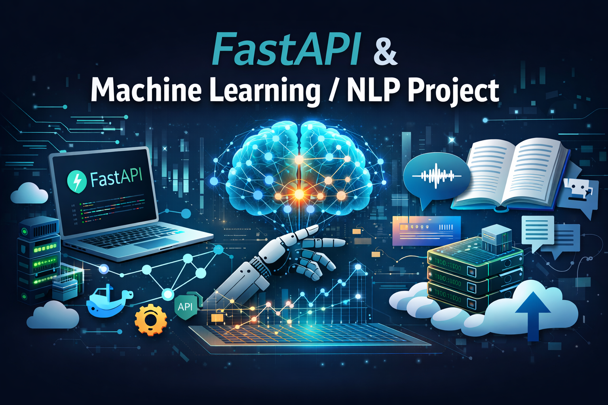

---


```markdown
<h1 align="center">🚀 FastAPI Machine Learning & NLP Project</h1>

<p align="center">
  Production-Ready ML API built with FastAPI, Docker, and MLOps concepts
</p>

<p align="center">
  
</p>

---

## 📌 Project Overview

This project demonstrates how to build and deploy a production-ready Machine Learning API using FastAPI.  
It includes model integration, API development, validation, and scalable deployment practices.

The goal of this project is to simulate real-world backend + ML system architecture.

---

## 🛠 Tech Stack

- Python
- FastAPI
- Pydantic
- Uvicorn
- Docker
- MLflow (optional)
- Git & GitHub

---

## 📂 Project Structure

```

fastapi-project/
│
├── app/
│   ├── main.py
│   ├── routers/
│   ├── models/
│   └── services/
│
├── assets/
│   └── cover.png
│
├── requirements.txt
├── Dockerfile
└── README.md

````

---

## ⚙️ Installation & Setup

### 1️⃣ Clone Repository

```bash
git clone https://github.com/your-username/your-repo.git
cd your-repo
````

### 2️⃣ Create Virtual Environment

```bash
conda create -n venv_api python=3.10
conda activate venv_api
```

### 3️⃣ Install Dependencies

```bash
pip install -r requirements.txt
```

### 4️⃣ Run Server

```bash
uvicorn main:app --reload
```

Server will run at:

```
http://127.0.0.1:8000
```

Swagger UI:

```
http://127.0.0.1:8000/docs
```

---

## 📡 API Endpoints

| Method | Endpoint  | Description      |
| ------ | --------- | ---------------- |
| GET    | /products | Get all products |
| POST   | /products | Add new product  |

---

## 🧠 Features

* Request validation using Pydantic
* Automatic API documentation
* Clean modular structure
* Production-ready backend setup
* Docker support (optional)

---

## 🐳 Run with Docker (Optional)

```bash
docker build -t fastapi-ml-app .
docker run -p 8000:8000 fastapi-ml-app
```

---

## 🚀 Future Improvements

* Database integration (PostgreSQL)
* Authentication (JWT)
* CI/CD Pipeline
* Cloud Deployment (AWS / Azure)
* Model versioning with MLflow

---

## 👨‍💻 Author

**Arif Miad**
Machine Learning & Backend Developer

GitHub: [https://github.com/Arif-miad](https://github.com/Arif-miad)

---

## ⭐ If you like this project

Give it a star ⭐ on GitHub!

```

---

  

---


```


